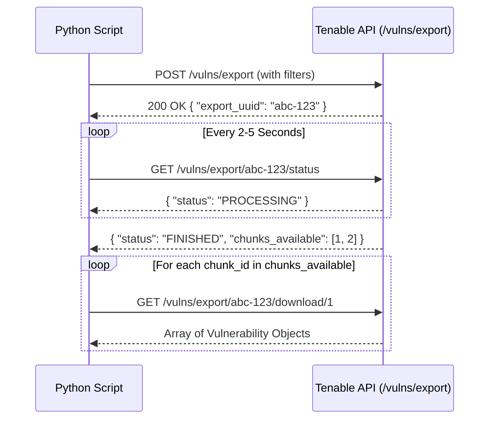

# 🛠️ Tenable API Python Builder Skill

This skill assists AI models and agents in writing robust, production-grade Python scripts to pull data from Tenable APIs (Vulnerability Management, Exposure Management, Asset Inventory, VPR/ACR Telemetry, and Workbenches).

---

## 🔑 Authentication & Request Guidelines

### API Key Headers
All requests to Tenable APIs (`https://cloud.tenable.com`) require `X-ApiKeys` header authentication:

```python
headers = {
    "X-ApiKeys": f"accessKey={access_key}; secretKey={secret_key};",
    "Content-Type": "application/json",
    "Accept": "application/json"
}
```

> [!IMPORTANT]
> Environment variables `TENABLE_ACCESS_KEY` and `TENABLE_SECRET_KEY` should always be prioritized over hardcoded keys.

---

## 📐 Choosing the Implementation Strategy

When creating Python scripts to pull Tenable data, select one of the following approaches based on the use case:

| Approach | Best Used For | Dependencies |
| :--- | :--- | :--- |
| **A. `pyTenable` SDK** *(Recommended)* | Clean, high-level Python code with built-in export polling and automatic error handling. | `pip install pyTenable` |
| **B. Native `requests` REST** | Fine-grained control, custom logging, and lightweight execution without extra SDKs. | `pip install requests` |
| **C. Standard Library (`urllib`)** | Zero-dependency environments where third-party packages cannot be installed. | Standard Python (`urllib.request`) |

---

## 🔄 Core Tenable API Patterns

### Pattern 1: Bulk Async Exports (High Volume Data)
For extracting large datasets (thousands of vulnerabilities or assets), **never use synchronous pagination**. Use the 3-step Async Export workflow:

1. **Initiate Export Job**: `POST /vulns/export` or `POST /assets/export`
2. **Poll Status**: `GET /vulns/export/{uuid}/status` until status is `"FINISHED"`
3. **Download Chunks**: `GET /vulns/export/{uuid}/download/{chunk_id}`



### Pattern 2: Workbench Queries (Fast Aggregations)
For quick dashboards, vulnerability counts, or asset summaries, use synchronous Workbench APIs:
- `GET /workbenches/vulnerabilities`
- `GET /workbenches/assets`
- `GET /workbenches/assets/{asset_id}/vulnerabilities`

---

## 📂 Included Resources & Templates

This skill includes ready-to-use Python templates and API reference docs:

- **Endpoint Catalog**: [`references/endpoint_catalog.md`](file:///C:/Users/benme/VisStudioC/Tenable%20Swarm/tenable-swarm/skills/tenable-api-builder/references/endpoint_catalog.md)
- **Async Exporter Template**: [`templates/fetch_vulnerabilities_template.py`](file:///C:/Users/benme/VisStudioC/Tenable%20Swarm/tenable-swarm/skills/tenable-api-builder/templates/fetch_vulnerabilities_template.py)
- **Asset Telemetry Template**: [`templates/fetch_assets_template.py`](file:///C:/Users/benme/VisStudioC/Tenable%20Swarm/tenable-swarm/skills/tenable-api-builder/templates/fetch_assets_template.py)
- **pyTenable SDK Example**: [`templates/pytenable_sdk_example.py`](file:///C:/Users/benme/VisStudioC/Tenable%20Swarm/tenable-swarm/skills/tenable-api-builder/templates/pytenable_sdk_example.py)

---

## 🤖 Instructions for AI Agents Generating Scripts

When user asks to write a Python script for Tenable data:
1. **Identify the Data Type**:
   - Vulnerabilities $\rightarrow$ Use `vulns/export` or `workbenches`.
   - Assets & ACR Scores $\rightarrow$ Use `assets/export`.
   - VPR / Plugin Info $\rightarrow$ Query `plugins/plugin/{id}`.
2. **Include Error Handling**: Catch HTTP 401 (Invalid Keys), HTTP 429 (Rate Limit / Backoff), and HTTP 500.
3. **Include Environment Variable Fallbacks**: Support `os.getenv("TENABLE_ACCESS_KEY")` and `os.getenv("TENABLE_SECRET_KEY")`.
4. **Use JSON Output Formatting**: Save clean, structured JSON or CSV output.
